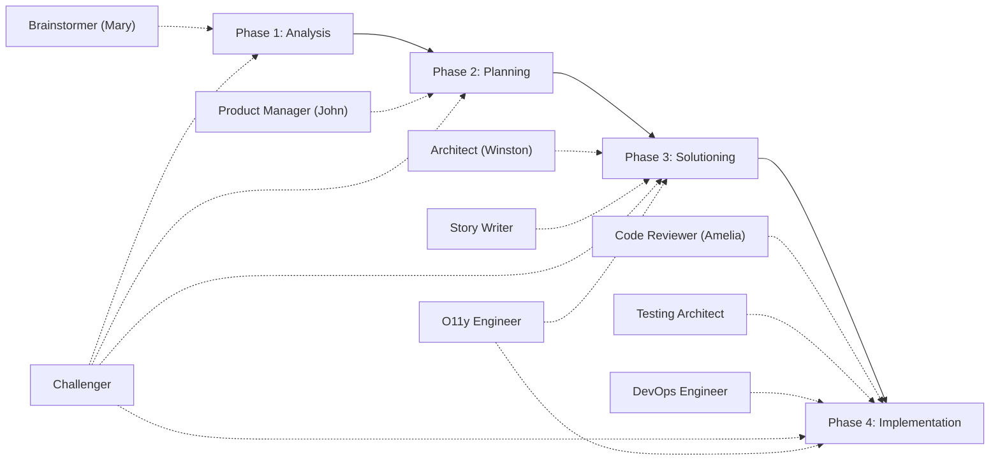

# BMAD Paperclip Template

**Ship products with a team of 9 AI agents that follow a proven methodology.**

The BMAD Method (Brainstorm, Map, Architect, Deliver) gives your [Paperclip](https://paperclip.ing) agents a structured way to take a product idea from initial research all the way to production code. Each agent has a defined role, a unique persona, and explicit collaboration rules. You assign one task — the agents handle the rest.

[](https://henrikrexed.github.io/Paperclip-Bmad-Crew/)

---

## Why BMAD?

Most AI agent setups are either too rigid (single-agent scripts) or too loose (agents with no defined handoff). BMAD solves this with **ticket-driven handoffs**: when an agent finishes their work, they create Paperclip tickets and assign them to the next agent. Every transition is explicit, traceable, and auditable.

- **No manual routing** — agents delegate work to each other automatically
- **Quality gates at every phase** — the Challenger agent reviews artifacts before handoffs
- **Full traceability** — every decision, handoff, and artifact is linked through Paperclip tickets
- **Customizable** — modify agent personas, add new agents, or adjust collaboration patterns

---

## Quick Start

**Prerequisites:** [Paperclip](https://paperclip.ing) installed (`npm install -g paperclipai`), [Claude Code](https://claude.ai/claude-code) or another supported LLM adapter.

If you already run a Paperclip company, the bundled `setup.sh` does the whole onboarding in one command:

```bash
# 1. Clone the template
git clone https://github.com/henrikrexed/Paperclip-Bmad-Crew.git
cd Paperclip-Bmad-Crew

# 2. Authenticate the CLI as a board user (import is board-gated)
npx paperclipai auth login

# 3. Provision the whole crew — installs the BMAD skill content AND imports the
#    10 agents + reporting hierarchy + skill references, in the right order.
./setup.sh --company-id <your-company-id>
#    Attaching the crew under an existing CEO? Pass it in and the script prints
#    the exact re-parent command on success:
#      ./setup.sh --company-id <your-company-id> --ceo-agent-id <your-ceo-agent-id>

# 4. Assign a research task to the Brainstormer and watch the workflow unfold
npx paperclipai issue create \
  --company-id <your-company-id> \
  --title "Research: [your topic]" \
  --description "Conduct market research and produce a product brief." \
  --assignee-agent-id <brainstormer-agent-id> \
  --status todo
```

`setup.sh` runs two steps for you: it installs the `bmad-*` skill content from the upstream [BMAD-METHOD](https://github.com/bmad-code-org/BMAD-METHOD) repo, then imports the company package — all 10 agents (a crew manager plus the 9 BMAD specialists) with their personas, capabilities, collaboration rules, per-agent skill references, reporting hierarchy, and artifact-directory conventions. Running the skill install first means every reference resolves on the first pass, with no missing-skill warnings.

**Fresh Paperclip install with no company yet?** `company import --target new` creates the company and crew together, but the skill content still has to be installed against the new company's UUID afterward. The [Getting Started guide](https://henrikrexed.github.io/Paperclip-Bmad-Crew/getting-started/) walks through both the **empty-instance** (Path A) and **existing-org** (Path B) paths step by step, including skill installation and verification.

> **Skills are installed from upstream, not vendored.** The `agents/<slug>/AGENTS.md` files *reference* skills by canonical key; the `bmad-*` skill bodies are pulled from upstream [BMAD-METHOD](https://github.com/bmad-code-org/BMAD-METHOD) by `setup.sh` at setup time. Nothing is copied into this repo — that avoids IP/licensing concerns and staleness. See [`skills-manifest.md`](skills-manifest.md) for the full list of installed skills and the per-agent mapping.

<details>
<summary>Prefer to run the steps manually?</summary>

```bash
# Install the BMAD skill content into the company first, so the agent import
# resolves every skill reference immediately.
npx paperclipai skills import https://github.com/bmad-code-org/BMAD-METHOD --company-id <your-company-id>

# Then import the crew.
npx paperclipai company import ./ --target existing --company-id <your-company-id> --include agents
```

The two core paperclip skills (`paperclip`, `para-memory-files`) are seeded into every company automatically; only the `bmad-*` skills need the explicit install above.

</details>

---

## The BMAD Workflow



| Phase | Focus | Primary Agent | Key Outputs |
|-------|-------|---------------|-------------|
| **1. Analysis** | Research, domain analysis, feasibility | Brainstormer (Mary) | Research reports, product briefs, PRFAQs |
| **2. Planning** | Requirements, prioritization | Product Manager (John) | PRDs, epics, readiness reports |
| **3. Solutioning** | Architecture, story decomposition | Architect (Winston), Story Writer | Architecture docs, implementation-ready stories |
| **4. Implementation** | Code, tests, infra, deployment | Code Reviewer (Amelia), Testing Architect, DevOps Engineer | Reviewed code, test suites, CI/CD pipelines |

The **Challenger** operates across all phases as an adversarial quality gate. The **O11y Engineer** spans Phases 3-4, adding observability with OpenTelemetry instrumentation.

---

## The 9 Agents

| Agent | Persona | Role | Key Capabilities |
|-------|---------|------|-----------------|
| **Brainstormer** | Mary | Analysis lead | Market research, competitive analysis, PRFAQ creation, domain deep dives |
| **Product Manager** | John | Planning lead | PRD creation, epic decomposition, readiness checks, course corrections |
| **Architect** | Winston | Solutioning lead | 8-step architecture design, technology selection, trade-off analysis |
| **Story Writer** | — | Story specialist | Story decomposition, GWT acceptance criteria, task sequencing |
| **Code Reviewer** | Amelia | Code quality | 3-layer adversarial review (Blind Hunter, Edge Case Hunter, Acceptance Auditor) |
| **Testing Architect** | — | Test strategy | API, E2E, and integration test generation, coverage assessment |
| **DevOps Engineer** | — | Platform & CI/CD | Pipeline setup, container orchestration, IaC, deployment automation |
| **Challenger** | — | Quality gate | Adversarial review, gap analysis, edge case identification |
| **O11y Engineer** | — | Observability | OpenTelemetry instrumentation, Dynatrace integration, 59 capabilities across 14 domains |

---

## How Ticket Handoffs Work

BMAD's core mechanism is agent-to-agent delegation through Paperclip tickets:

```
Board assigns research task → Brainstormer (Mary)
  Mary completes analysis → creates planning ticket → Product Manager (John)
    John writes PRD → creates tickets → Architect (Winston) + Story Writer + O11y Engineer
      Winston designs architecture → creates tickets → Code Reviewer + DevOps + Testing Architect + O11y
```

Each agent **owns the transition out of their phase**. No manual routing is needed after the initial task assignment. The Challenger is pulled in at phase boundaries to validate quality before work moves forward.

---

## Repository Structure

```
.
├── README.md               # This file
├── setup.sh                # One-command turnkey onboarding (skills + agent import)
├── skills-manifest.md      # Every bmad-* skill setup.sh installs + per-agent map
├── CONTRIBUTING.md          # Guide for contributors
├── mkdocs.yml              # Documentation site config
├── requirements.txt        # Python dependencies (MkDocs)
├── agents/                 # Agent configurations
│   ├── brainstormer/       #   Each agent has an AGENTS.md
│   ├── product-manager/    #   defining persona, capabilities,
│   ├── architect/          #   and collaboration rules
│   ├── story-writer/
│   ├── code-reviewer/
│   ├── testing-architect/
│   ├── devops-engineer/
│   ├── challenger/
│   └── o11y-engineer/
└── docs/                   # MkDocs documentation source
    ├── index.md
    ├── getting-started.md
    ├── workflow-phases.md
    ├── agents/
    └── collaboration/
```

---

## Customization

Each agent's behavior is defined in its `AGENTS.md` file under `agents/`. You can:

- **Modify personas** — change communication styles, expertise areas, or decision-making approaches
- **Add new agents** — create a directory under `agents/` with an `AGENTS.md`, add a docs page, and update `mkdocs.yml`
- **Adjust collaboration patterns** — change which agents create tickets for whom, or add new quality gates
- **Configure artifact paths** — set `{planning_artifacts}/` and `{implementation_artifacts}/` directories per project

---

## Documentation

Full documentation with diagrams, per-agent deep dives, and collaboration patterns:

| Resource | Description |
|----------|-------------|
| [Getting Started](https://henrikrexed.github.io/Paperclip-Bmad-Crew/getting-started/) | Empty-instance & existing-org onboarding, import, first workflow |
| [Workflow Phases](https://henrikrexed.github.io/Paperclip-Bmad-Crew/workflow-phases/) | Detailed phase docs with ticket flow diagrams |
| [Agents](https://henrikrexed.github.io/Paperclip-Bmad-Crew/agents/) | Per-agent capabilities and collaboration rules |
| [Collaboration](https://henrikrexed.github.io/Paperclip-Bmad-Crew/collaboration/) | Cross-agent interaction patterns |

---

## Contributing

Want to improve the template, add agents, or build the docs site locally? See [CONTRIBUTING.md](CONTRIBUTING.md).

```bash
pip install -r requirements.txt
mkdocs serve  # Preview at http://127.0.0.1:8000
```

---

## References

- [Paperclip](https://paperclip.ing) — The AI agent orchestration platform
- [O11y Engineer source](https://github.com/henrikrexed/bmad-observability-agent/blob/main/agents/o11y-engineer.md) — The observability agent this template builds on

## License

This template is provided as a community resource. See individual skill repositories for their respective licenses.
