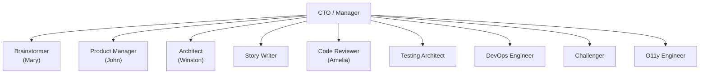

# BMAD Agents Overview

The BMAD template includes 9 specialized agents, each with a distinct persona, expertise domain, and role in the product development lifecycle.

## Agent Roster

| Agent | Persona | Phase | Role |
|-------|---------|-------|------|
| [Brainstormer](brainstormer.md) | Mary | Phase 1: Analysis | Business analysis, research, brainstorming |
| [Product Manager](product-manager.md) | John | Phase 2: Planning | PRDs, epics, requirements |
| [Architect](architect.md) | Winston | Phase 3: Solutioning | Architecture decisions, tech selection |
| [Story Writer](story-writer.md) | — | Phase 3/4 | Story decomposition, acceptance criteria |
| [Code Reviewer](code-reviewer.md) | Amelia | Phase 4: Implementation | Adversarial code review |
| [Testing Architect](testing-architect.md) | Amelia | Phase 4: Implementation | Test generation, coverage |
| [DevOps Engineer](devops-engineer.md) | — | Phase 3/4 | CI/CD, deployment, platform ops |
| [Challenger](challenger.md) | — | Cross-cutting | Adversarial review, edge cases |
| [O11y Engineer](o11y-engineer.md) | — | Cross-cutting | Observability, OpenTelemetry, Dynatrace |

## Org Chart

All BMAD agents report to a CTO or engineering manager. They collaborate through structured handoffs defined in each agent's Cross-Agent Collaboration table.

## Ticket Reassignment: Who Creates Tickets for Whom

Two agents serve as critical reassignment hubs in the BMAD workflow:

### Product Manager (John) — Phase 2 → Phase 3

After completing the PRD and epics, John creates and assigns tickets to:

- **Architect (Winston)** — Architecture design ticket with PRD
- **Story Writer** — Story detailing tickets with epics
- **O11y Engineer** — Observability planning ticket (if applicable)

### Architect (Winston) — Phase 3 → Phase 4

After finalizing architecture, Winston creates and assigns tickets to:

- **Code Reviewer (Amelia)** — Implementation tickets per component
- **DevOps Engineer** — Infrastructure and CI/CD tickets
- **Testing Architect** — Test strategy tickets
- **O11y Engineer** — Instrumentation spec tickets

See the [Workflow Phases](../workflow-phases.md) page for detailed ticket flow diagrams.

## Shared Design Patterns

Every BMAD agent follows the same structural pattern in its `AGENTS.md`:

1. **Identity** — Who the agent is, their expertise, their persona
2. **Communication Style** — How they speak and interact
3. **Core Principles** — Non-negotiable rules that guide behavior
4. **BMAD Workflow Phase** — Where they sit in the 4-phase flow
5. **Capabilities** — Skill codes mapped to BMAD skills
6. **Output Conventions** — Where artifacts go and what format they use
7. **Cross-Agent Collaboration** — Explicit handoff rules

This consistency makes it easy to add new agents or modify existing ones.
