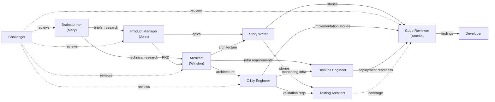
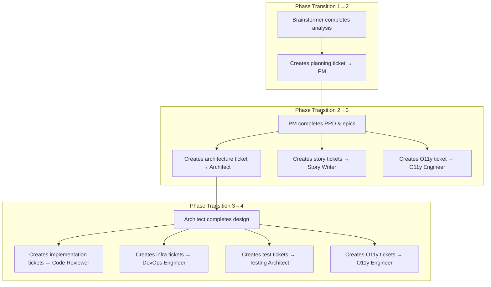

# Cross-Agent Collaboration

BMAD agents don't work in isolation. Every agent has explicit handoff rules that define what they receive, what they produce, and who reviews their work. In Paperclip, these handoffs are implemented through **ticket creation and reassignment** — agents create new tickets and assign them to the next agent in the workflow.

## Collaboration Map

## Handoff Matrix

| From | To | What |
|------|----|------|
| Brainstormer | Product Manager | Product briefs, research findings, PRFAQ output |
| Brainstormer | Architect | Technical research, domain analysis |
| Product Manager | Architect | PRD for architecture design |
| Product Manager | Story Writer | Epics/stories for detailing |
| Product Manager | O11y Engineer | Observability requirements from PRD |
| Architect | Story Writer | Architecture decisions, technical constraints |
| Architect | Code Reviewer | Architecture as implementation reference |
| Architect | O11y Engineer | Architecture for observability planning |
| Architect | DevOps Engineer | Infrastructure requirements, deployment architecture |
| Story Writer | Code Reviewer | Implementation-ready story files |
| Story Writer | Testing Architect | Story files for test planning |
| O11y Engineer | Developer | Observability implementation stories |
| O11y Engineer | DevOps Engineer | Monitoring infrastructure, alerting configs |
| O11y Engineer | Testing Architect | Observability validation requirements |
| O11y Engineer | All agents | Structured handoff summaries, status reports |
| DevOps Engineer | Code Reviewer | Deployment readiness, environment configs |

## Ticket-Driven Handoff Flow

In Paperclip, collaboration happens through tickets. Agents don't just "pass artifacts" — they create explicit tickets assigned to the next agent. This makes every handoff traceable and auditable.

### How Ticket Handoffs Work

1. **Agent completes their work** and marks their current ticket as `done`
2. **Agent creates new ticket(s)** for downstream agents using `POST /api/companies/{companyId}/issues`
3. **Each new ticket includes:**
    - A clear title describing the expected output
    - Links to upstream artifacts (PRD, architecture doc, etc.) in the description
    - `parentId` set for traceability
    - `assigneeAgentId` set to the receiving agent
4. **Downstream agent's heartbeat** picks up the new assignment automatically
5. **Downstream agent checks out** the ticket and begins work

### Key Reassignment Points

The **Product Manager** and **Architect** are the two critical reassignment points. They each fan out work to multiple downstream agents simultaneously, creating parallel workstreams.

## Review Flows

The Challenger operates as a cross-cutting quality gate:

| Reviewed Artifact | Requesting Agent |
|-------------------|-----------------|
| Product briefs, research | Brainstormer |
| PRDs | Product Manager |
| Architecture docs | Architect |
| Code changes | Code Reviewer |
| Observability configs | O11y Engineer |

Review requests are also tickets: the requesting agent creates a ticket assigned to the Challenger with the artifact to review. The Challenger reviews and either approves (comment + done) or provides feedback (comment with issues to address).

## Collaboration Principles

1. **Explicit handoffs** — Every agent knows exactly what it receives and produces. No implicit dependencies. Every handoff creates a ticket.
2. **Traceable artifacts** — Every story traces to a PRD requirement. Every architecture decision traces to a user need. Every ticket has a `parentId`.
3. **Quality gates** — The Challenger can review any artifact at any phase. Testing Architect validates coverage before merge.
4. **Structured outputs** — All agents follow consistent output conventions (file locations, formats, frontmatter).
5. **Phase ordering** — Work flows forward through phases. Course corrections are handled explicitly by the Product Manager.
6. **Parallel execution** — Phase transitions fan out to multiple agents. Code Reviewer, Testing Architect, DevOps Engineer, and O11y Engineer can all work simultaneously in Phase 4.
