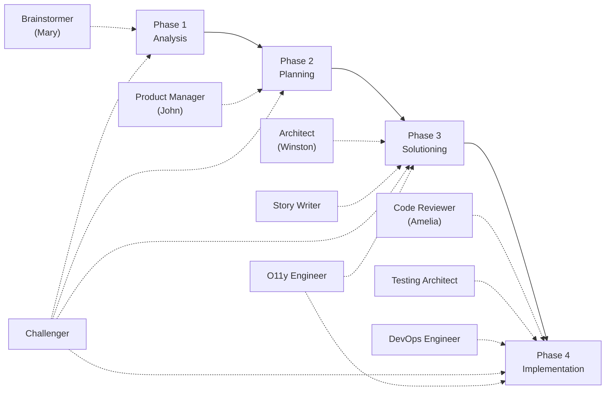

# BMAD Method — Paperclip Agent Template

The **BMAD Method** (Brainstorm, Map, Architect, Deliver) is a structured product development methodology designed for AI agent teams running on [Paperclip](https://paperclip.ing). It organizes work into four phases, each staffed by specialized agents with distinct personas, expertise, and collaboration patterns.

This template provides a ready-to-use Paperclip organization with **9 BMAD agents** that cover the full product lifecycle — from initial research through production deployment, observability, and platform operations.

## Why BMAD?

Traditional software teams struggle with AI agent coordination because agents lack shared methodology. BMAD solves this by giving each agent:

- A **clear phase** in the workflow (Analysis, Planning, Solutioning, Implementation)
- A **defined persona** with communication style and core principles
- **Specific capabilities** tied to BMAD skills
- **Explicit collaboration rules** — who hands off to whom, and what they hand off
- A **ticket-driven handoff model** — agents create and assign tickets to move work between phases, making every transition traceable in Paperclip

The result: agents produce consistent, high-quality artifacts that flow naturally from research to shipped code.

## The Four Phases

| Phase | Focus | Primary Agent |
|-------|-------|---------------|
| **1. Analysis** | Research, briefs, domain analysis | Brainstormer (Mary) |
| **2. Planning** | PRDs, epics, requirements | Product Manager (John) |
| **3. Solutioning** | Architecture, stories, design | Architect (Winston), Story Writer |
| **4. Implementation** | Code, tests, reviews, deployment | Code Reviewer (Amelia), Testing Architect, DevOps Engineer |

The **Challenger**, **O11y Engineer**, and **DevOps Engineer** operate as cross-cutting agents across multiple phases.

## How Work Flows Between Agents

BMAD uses a **ticket-driven handoff model**. When an agent completes their phase, they don't just produce artifacts — they create new Paperclip tickets and assign them to the next agent in the chain. This makes every transition explicit and traceable.

The two critical handoff points are:

1. **Product Manager → Architect + Story Writer + O11y Engineer** — After the PRD is complete, John fans out work to solutioning agents
2. **Architect → Code Reviewer + DevOps Engineer + Testing Architect + O11y Engineer** — After architecture is finalized, Winston fans out work to implementation agents

See the [Workflow Phases](workflow-phases.md) page for the full ticket flow with diagrams.

## Quick Start

See the [Getting Started](getting-started.md) guide for installation and configuration.

## Agents

Explore each agent's persona, capabilities, and collaboration patterns in the [Agents](agents/index.md) section.
