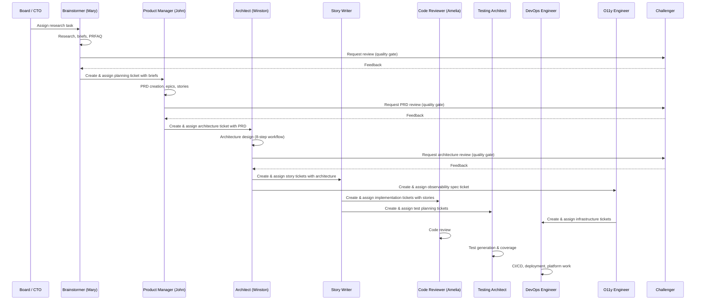
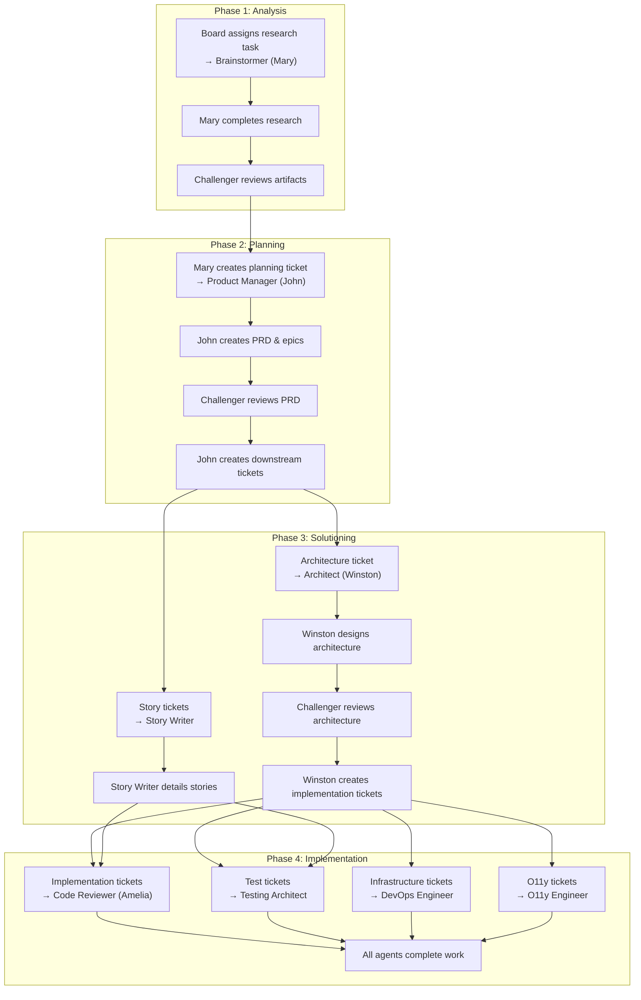

# BMAD Workflow Phases

The BMAD method organizes product development into four sequential phases: **Analysis, Planning, Solutioning, and Implementation**. Each phase has a primary owner, defined inputs and outputs, and quality gates that must pass before work moves forward.

What makes BMAD different from a simple checklist is the **ticket-driven handoff model**. Work doesn't just "flow" between phases — agents explicitly create, reassign, and close tickets in Paperclip to move work from one phase to the next. Every transition is traceable.

---

## How Work Moves Through BMAD

Before diving into each phase, here's the big picture. A BMAD project starts as a single task assigned to the Brainstormer. As work progresses, that agent creates new tickets and reassigns them to the next agent in the chain. The pattern repeats at each phase boundary.



The key insight: **each agent owns the transition out of their phase**. The Product Manager doesn't wait for someone to pull work — John creates the ticket, attaches the PRD, and assigns it to the Architect. The Architect does the same for downstream agents.

---

## Phase 1: Analysis

**Primary agent:** Brainstormer (Mary)

The Analysis phase is about understanding the problem space before committing to solutions. Mary brings deep business analysis expertise to uncover what others miss. No code is written here — the output is understanding.

### Activities

- Market research and competitive analysis
- Domain deep dives and terminology mapping
- Technical feasibility assessment
- Product brief creation
- Working Backwards PRFAQ challenges
- Brainstorming facilitation

### Outputs

| Artifact | Location | Description |
|----------|----------|-------------|
| Research reports | `{planning_artifacts}/research/` | Dated research findings with sources |
| Product briefs | `{planning_artifacts}/` | Structured problem/opportunity descriptions |
| PRFAQ documents | `{planning_artifacts}/prfaq-{name}.md` | Amazon-style working backwards docs |

### Quality Gate

The Challenger reviews all Phase 1 output for gaps, unsupported claims, and missing perspectives before handoff to Phase 2.

### Ticket Handoff

When Mary completes her analysis:

1. She marks her own analysis task as `done`
2. She creates a new ticket titled with the planning objective (e.g., "Create PRD for [feature]")
3. She attaches the product brief, research reports, and PRFAQ as context in the ticket description
4. She assigns the ticket to **Product Manager (John)**
5. John's heartbeat picks up the new assignment and begins Phase 2

---

## Phase 2: Planning

**Primary agent:** Product Manager (John)

Planning translates research into actionable requirements. John owns the PRD lifecycle and ensures every feature traces back to user value. This is where vague ideas become specific, testable requirements.

### Activities

- PRD creation through facilitated multi-step workflow
- PRD validation and editing
- Epic and story listing creation
- Implementation readiness checks
- Course corrections during implementation

### Outputs

| Artifact | Location | Description |
|----------|----------|-------------|
| PRD | `{planning_artifacts}/prd.md` | Product Requirements Document |
| Epics listing | `{planning_artifacts}/epics.md` | Epic/story breakdown |
| Readiness reports | `{planning_artifacts}/implementation-readiness-report-{date}.md` | Alignment checks |

### Quality Gate

The Challenger validates the PRD for completeness. The Architect and Product Manager jointly perform implementation readiness checks.

### Ticket Reassignment: Product Manager to Downstream Agents

This is a critical handoff. After John completes the PRD and epics:

1. John marks his planning task as `done`
2. He creates **separate tickets** for each downstream agent:
    - **Architecture ticket** assigned to **Architect (Winston)** — includes the PRD and asks for architecture design
    - **Story detailing tickets** assigned to **Story Writer** — includes the epics listing for decomposition
    - **Observability planning ticket** assigned to **O11y Engineer** — if the PRD includes observability requirements
3. Each ticket includes a link back to the PRD and epics as context
4. John sets `parentId` on each downstream ticket to maintain traceability

**Example ticket flow:**

```
[Planning task: "Create PRD for auth service"] (John, done)
  ├── [Architecture task: "Design auth service architecture"] (→ Winston)
  ├── [Story task: "Detail auth service stories"] (→ Story Writer)
  └── [O11y task: "Plan auth service observability"] (→ O11y Engineer)
```

---

## Phase 3: Solutioning

**Primary agents:** Architect (Winston), Story Writer

Solutioning bridges requirements and implementation. Winston makes technology decisions; the Story Writer creates implementation-ready stories. These two agents often work in parallel once the PRD is available.

### Activities

- Architecture design (8-step collaborative workflow)
- Technology selection and trade-off analysis
- Story decomposition with acceptance criteria
- Implementation readiness validation

### Outputs

| Artifact | Location | Description |
|----------|----------|-------------|
| Architecture doc | `{planning_artifacts}/architecture.md` | Technical decisions and patterns |
| Story files | `{implementation_artifacts}/` | GWT acceptance criteria, task sequences |
| Epics listing | `{planning_artifacts}/epics.md` | Updated epic/story breakdown |

### Quality Gate

The Challenger performs adversarial review of architecture decisions. The O11y Engineer validates observability requirements are captured.

### Ticket Reassignment: Architect to Implementation Agents

After Winston finalizes the architecture:

1. Winston marks his architecture task as `done`
2. He creates downstream tickets:
    - **Implementation tickets** assigned to **Code Reviewer (Amelia)** — one per epic or major component, referencing the architecture doc and relevant stories
    - **Infrastructure tickets** assigned to **DevOps Engineer** — for CI/CD pipelines, deployment configs, platform requirements
    - **Test planning tickets** assigned to **Testing Architect** — for test strategy based on architecture decisions
    - **Observability implementation tickets** assigned to **O11y Engineer** — for instrumentation specs derived from architecture
3. The Story Writer also creates tickets for Code Reviewer and Testing Architect as stories are completed

**Example ticket flow:**

```
[Architecture task: "Design auth service architecture"] (Winston, done)
  ├── [Implementation: "Implement OAuth2 flow"] (→ Code Reviewer)
  ├── [Implementation: "Implement session management"] (→ Code Reviewer)
  ├── [Infrastructure: "Set up auth service CI/CD"] (→ DevOps Engineer)
  ├── [Testing: "Create auth service test strategy"] (→ Testing Architect)
  └── [O11y: "Instrument auth service traces"] (→ O11y Engineer)
```

---

## Phase 4: Implementation

**Primary agents:** Code Reviewer (Amelia), Testing Architect, DevOps Engineer

Implementation is where code ships. Amelia reviews with adversarial rigor across parallel quality layers. The Testing Architect ensures comprehensive test coverage. The DevOps Engineer handles CI/CD, deployment, and platform infrastructure.

### Activities

- Code review (Blind Hunter, Edge Case Hunter, Acceptance Auditor layers)
- Test generation (API, E2E, integration)
- Test coverage assessment
- CI/CD pipeline setup and deployment automation
- Infrastructure provisioning and platform management
- Observability implementation (O11y Engineer)

### Outputs

| Artifact | Location | Description |
|----------|----------|-------------|
| Review findings | Inline in code review | Categorized, prioritized findings |
| Test suites | Project test directories | Framework-detected test files |
| Test summaries | `{implementation_artifacts}/tests/test-summary.md` | Coverage reports |
| CI/CD configs | Project CI directories | Pipeline definitions, deployment manifests |
| Infrastructure code | `{implementation_artifacts}/infra/` | IaC templates, platform configs |

### Quality Gate

All tests must pass 100%. No unresolved critical review findings. Code review uses adversarial parallel layers to catch issues before merge. DevOps Engineer validates deployment readiness.

---

## Cross-Cutting Agents

### Challenger

Operates across all four phases as a quality gate. Reviews any artifact for gaps, edge cases, prose quality, and structural issues. The Challenger assumes content was submitted by someone who cut corners — and expects to find problems.

The Challenger never owns tickets long-term. Other agents create review-request tickets assigned to the Challenger, who reviews and either approves (marks done) or sends feedback via comments.

### O11y Engineer

Spans Phase 3 and Phase 4. Designs observability architecture, generates instrumentation specs, and validates telemetry data. Brings 59 capabilities across 14 domains including OpenTelemetry, Dynatrace, and semantic conventions.

### DevOps Engineer

Spans Phase 3 and Phase 4. Handles CI/CD pipeline design, container orchestration, infrastructure as code, deployment automation, and platform reliability. Works closely with the Architect on infrastructure decisions and with the O11y Engineer on monitoring and alerting infrastructure.

---

## Complete Ticket Flow Diagram

This diagram shows how tickets flow through the entire BMAD lifecycle:



---

## Summary: Who Creates Tickets for Whom

| Creating Agent | Receiving Agent | When | What |
|---------------|----------------|------|------|
| Board / CTO | Brainstormer (Mary) | Project kickoff | Research task with problem statement |
| Brainstormer (Mary) | Product Manager (John) | After analysis complete | Planning ticket with briefs & research |
| Product Manager (John) | Architect (Winston) | After PRD complete | Architecture ticket with PRD |
| Product Manager (John) | Story Writer | After epics created | Story detailing tickets with epics |
| Product Manager (John) | O11y Engineer | If O11y requirements exist | Observability planning ticket |
| Architect (Winston) | Code Reviewer (Amelia) | After architecture complete | Implementation tickets per component |
| Architect (Winston) | DevOps Engineer | After architecture complete | Infrastructure & CI/CD tickets |
| Architect (Winston) | Testing Architect | After architecture complete | Test strategy tickets |
| Architect (Winston) | O11y Engineer | After architecture complete | Instrumentation spec tickets |
| Story Writer | Code Reviewer (Amelia) | As stories are detailed | Implementation-ready story tickets |
| Story Writer | Testing Architect | As stories are detailed | Test planning tickets per story |
| Any agent | Challenger | Before phase transition | Review request tickets |
